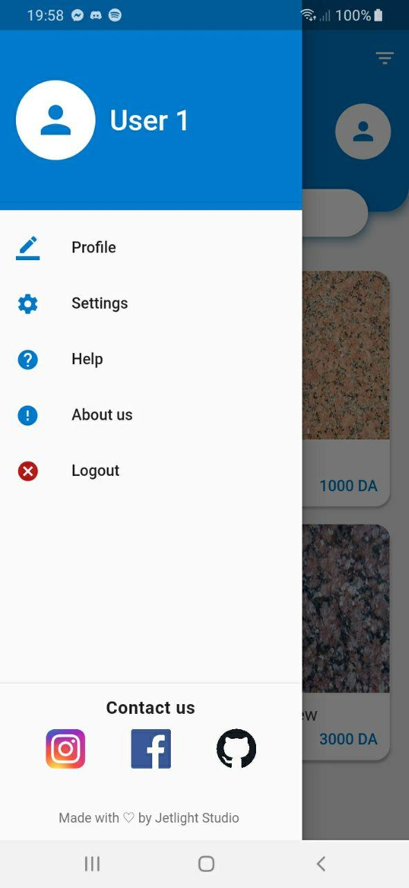

# Marbre-App

## Description:

This is an e-Shop marble App, made with Flutter, and the backend with Flask (Python).

### Backend Project Link:
(https://github.com/Mohammed-Benotmane/Marbre-Backend)

## ScreenShots:

   

## Tools & languages:
* Android studio (IDE)
* Dart (logic)
* Flutter (Mobile UI developement kit)

## Contribution:
Feel free to fork this project and add whatever you like. If you have any suggestions or any comments please feel free to contact me or to open an issue.

## Team:
[Jetlighters](https://github.com/JetLightStudio) having fun.
